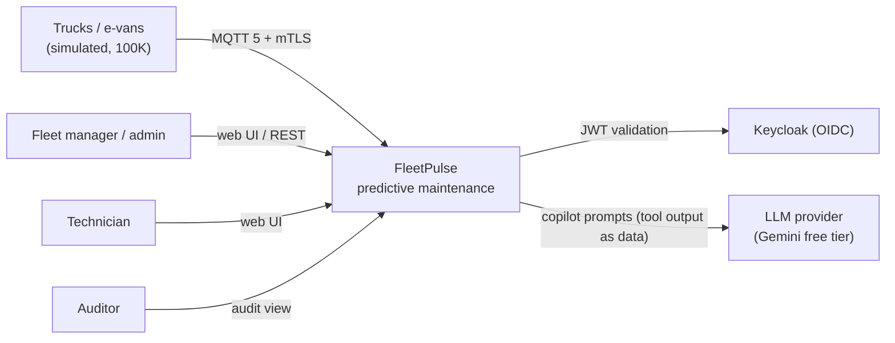
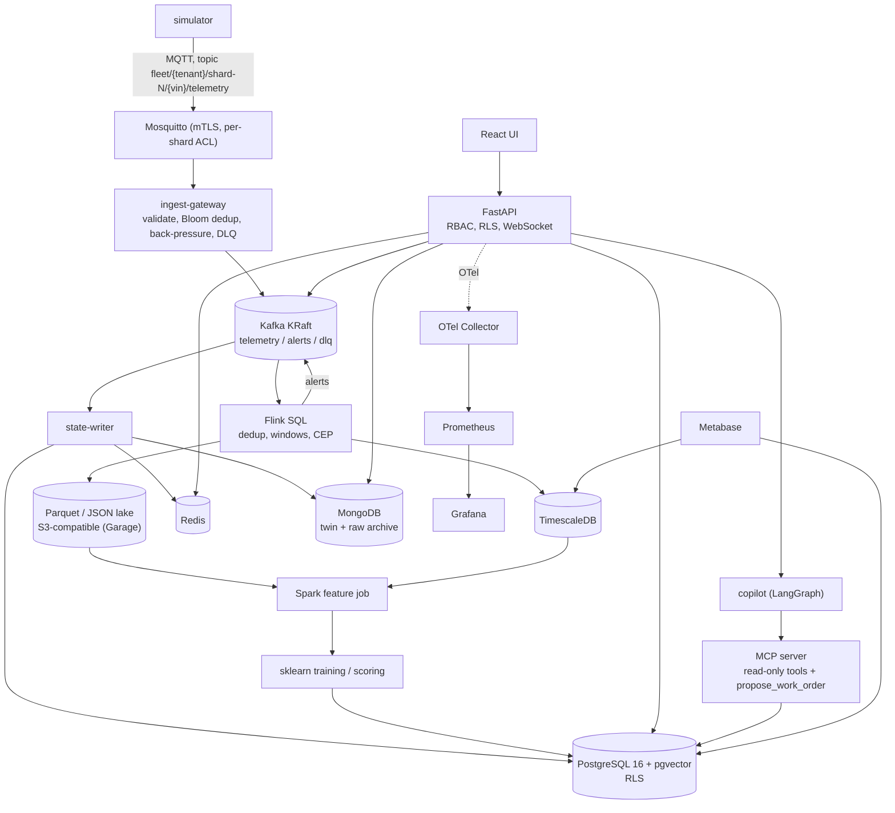
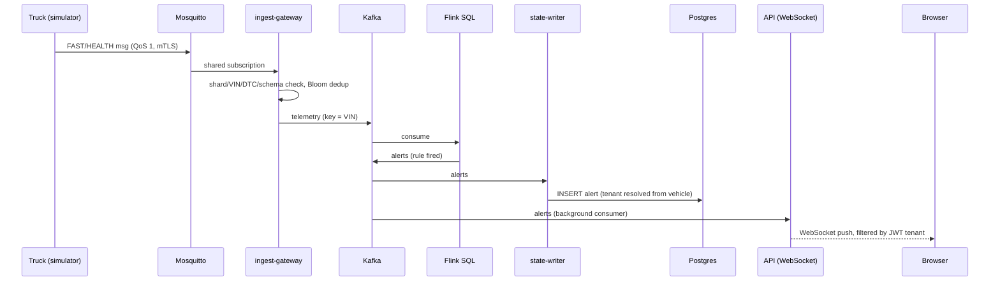
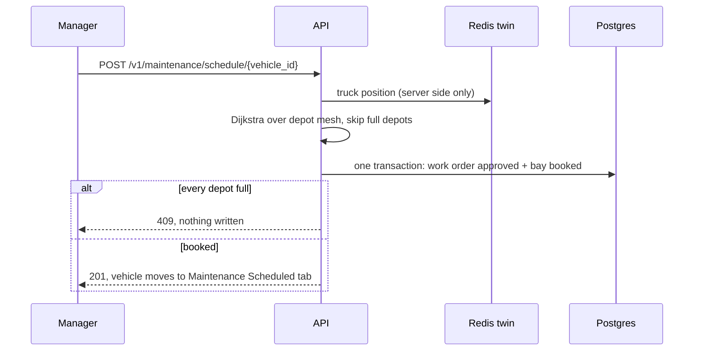

# C4 and sequence diagrams

Mermaid; renders on GitHub.

## C4 level 1: system context



## C4 level 2: containers



## Sequence: critical alert, fault to screen



## Sequence: copilot with human approval

```mermaid
sequenceDiagram
  participant U as Manager (browser)
  participant A as API
  participant C as copilot (LangGraph)
  participant L as LLM
  participant X as MCP server
  participant P as Postgres (RLS)
  U->>A: POST /v1/copilot/ask (JWT)
  A->>A: tenant + role from JWT, resolve tenant uuid
  A->>C: question + tenant/role (server-injected)
  loop up to 16 iterations
    C->>L: messages
    L-->>C: tool call (no tenant/role argument exposed)
    C->>X: tool + injected tenant/role
    X->>P: SET LOCAL app.tenant_id; query
    X->>P: audit_log row
    X-->>C: data (treated as data, not instructions)
  end
  C-->>A: answer
  A-->>U: reply
  Note over X,P: propose_work_order writes status=proposed.<br/>A human with approve rights must approve it.
```

## Sequence: schedule service from the at-risk list


