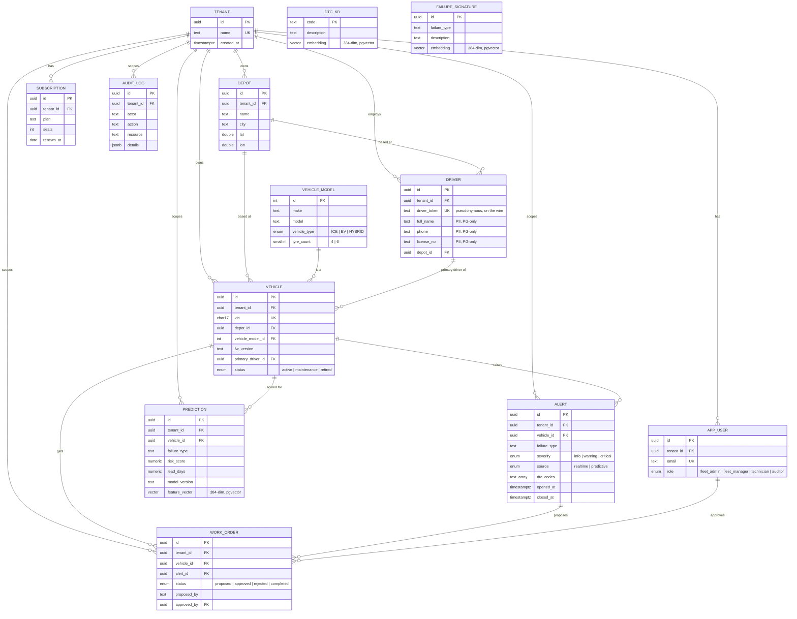

# PostgreSQL 3NF core — ER diagram

Source of truth: `db/postgres/migrations/002_core_schema.sql`. Telemetry itself
lives in TimescaleDB (`db/timescale/migrations`), not here — see PLAN §2 for
the OLTP/telemetry split rationale. `vehicle_model`, `dtc_kb` and
`failure_signature` are shared catalogues with no `tenant_id`; every other
table carries `tenant_id` and is RLS-scoped (`004_rls.sql`).

